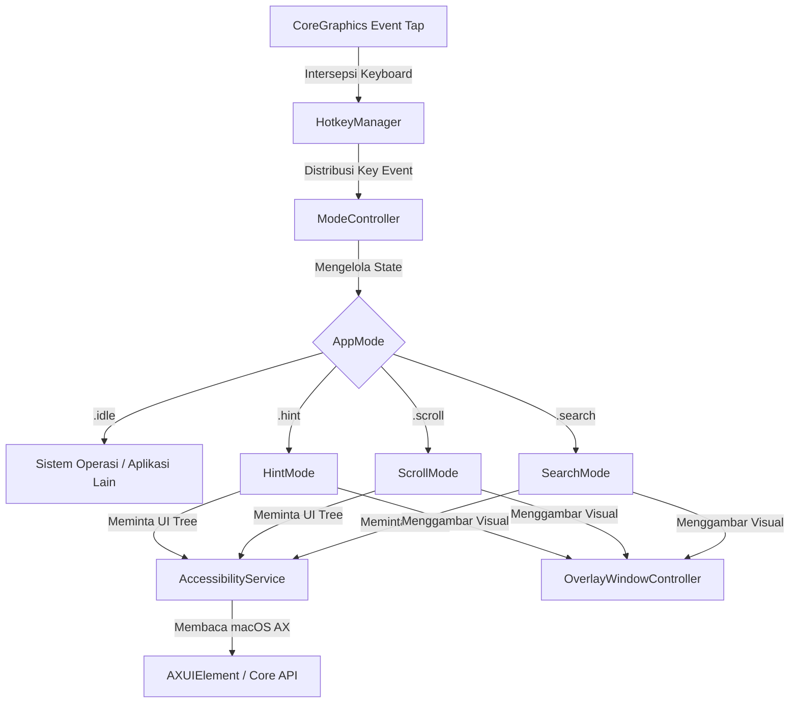
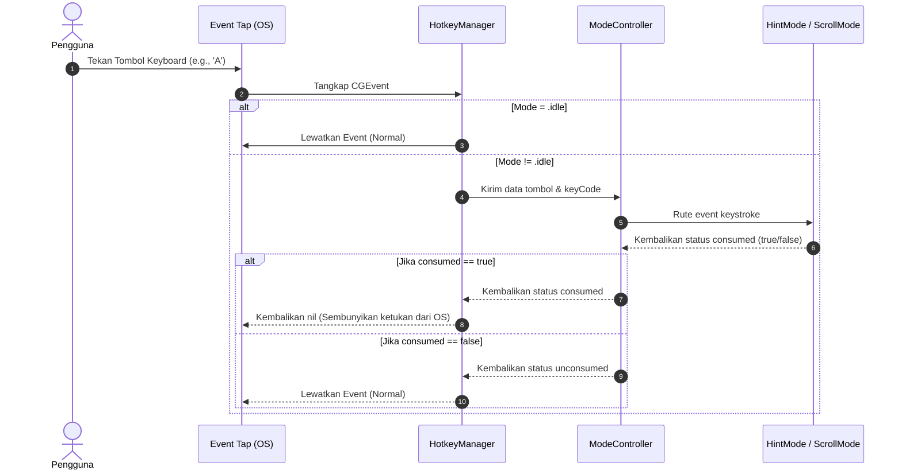

# 📘 Analisis Sistem & Dokumentasi Arsitektur: HoprClone

Dokumen ini menyajikan analisis mendalam mengenai arsitektur perangkat lunak, pola desain, alur data, serta keputusan rekayasa yang diimplementasikan pada proyek **HoprClone**. Analisis ini disusun dari sudut pandang **System Analyst** untuk memberikan pemahaman teknis komprehensif bagi pengembang yang ingin memelihara atau memperluas aplikasi.

---

## 1. Arsitektur Sistem Umum

HoprClone dirancang sebagai aplikasi utilitas macOS berkinerja tinggi yang berjalan di latar belakang (tipe agen/`.accessory`). Aplikasi ini tidak memiliki jendela utama saat pertama kali dibuka, melainkan mengandalkan sistem *floating overlay* transparan yang muncul secara interaktif.

Sistem terdiri dari empat pilar utama:

### 1.1 Deskripsi Komponen Arsitektur
*   **Keyboard Interception Layer (`HotkeyManager`)**: Menggunakan API CoreGraphics tingkat rendah (`CGEvent.tapCreate`) untuk memantau keystroke global secara asinkron sebelum diterima oleh aplikasi target.
*   **State Machine (`ModeController`)**: Menentukan perilaku aplikasi berdasarkan status aktif saat ini (`idle`, `hint`, `scroll`, `search`).
*   **Accessibility Engine (`AccessibilityService`)**: Menjembatani aplikasi dengan sistem operasi macOS untuk mengambil pohon aksesibilitas (*Accessibility Tree*) dari jendela aplikasi aktif.
*   **Overlay Rendering Engine (`OverlayWindowController`)**: Menampilkan representasi visual (balon kata penunjuk, batas area gulir) tepat di atas elemen GUI yang sesungguhnya di layar komputer.

---

## 2. Analisis Rinci Komponen Kode

### 2.1 Core Services (Layanan Inti)

#### `AccessibilityService.swift`
Layanan ini bertugas melakukan penelusuran (*tree traversal*) secara rekursif terhadap elemen GUI sistem operasi.
*   **Mekanisme Caching**: Untuk mencegah perlambatan akibat komunikasi antar-proses (IPC) dengan Accessibility API macOS, kelas ini menerapkan *Time-To-Live (TTL)* cache sebesar `1.5 detik` (`cacheTTL = 1.5`). Jika permintaan pemindaian dilakukan berulang kali dalam jeda waktu tersebut, layanan langsung mengembalikan data memori tanpa melakukan IPC ulang.
*   **Metode Traversal**: Menggunakan rekursi mendalam hingga `depth < 10` untuk mencari elemen UI dengan peran fungsional seperti tombol (`AXButton`), kotak teks (`AXTextField`), tautan (`AXLink`), dll.
*   **Algoritma Deduplikasi Tumpang Tindih (`deduplicateOverlapping`)**:
    *   Sering kali dalam struktur hierarki macOS AX, elemen penampung (*parent*) memiliki area koordinat yang bertabrakan dengan elemen anak (*child*).
    *   Algoritma menghitung rasio interseksi area dari dua elemen: jika tumpang tindih melebihi `40%`, sistem akan memprioritaskan peran elemen yang lebih spesifik (misalnya, tombol lebih diprioritaskan daripada grup kontainer statis).

#### `UIElement.swift`
Sebuah model pembungkus (`struct wrapper`) untuk pointer internal `AXUIElement` macOS.
*   **Aksi Simulasi & Native**: Ketika label dipilih, `performAction()` akan mencoba memicu aksi aksesibilitas bawaan terlebih dahulu (seperti `AXPress`, `AXOpen`, `AXConfirm`, atau `AXPick`). Jika aplikasi target tidak menanggapi aksi tersebut, sistem secara otomatis beralih menggunakan simulasi tingkat rendah, yaitu mengirimkan event mouse down dan mouse up secara instan pada koordinat tengah elemen (`simulateClick()`).

---

### 2.2 Input Handling & Event Distribution

#### `HotkeyManager.swift`
Bertugas mendaftarkan event tap keyboard di bawah mode `.cgSessionEventTap`.
*   **Pencegatan Input (Event Suppression)**: Ketika aplikasi berada dalam salah satu mode aktif (`hint`, `scroll`, `search`), `handleEvent` akan mengembalikan nilai `nil` untuk setiap tombol yang digunakan dalam interaksi internal. Ini secara efektif menekan tombol tersebut agar tidak masuk ke sistem operasi atau aplikasi aktif di belakang layar, sehingga mencegah karakter terketik secara tidak sengaja di dokumen pengguna.
*   **Fungsi Pemetaan Tombol**: Mengonversi kode kunci virtual (`keyCode` perangkat keras) menjadi karakter string yang relevan dengan mempertimbangkan status penekanan tombol `Shift`.

---

### 2.3 Visual & Rendering Engine

#### `OverlayWindowController.swift`
Merupakan komponen krusial yang mengontrol antarmuka grafis di layar.
*   **Optimasi Jendela Tunggal (Single-Window Optimization)**:
    > [!IMPORTANT]
    > Alih-alih membuat satu jendela (`NSWindow`) terpisah untuk setiap label petunjuk (yang akan membebani komposit grafis macOS jika ada lebih dari 100 elemen), sistem membuat **satu jendela transparan raksasa** yang membentang di seluruh layar (`screenFrame`). Semua objek label (`LabelView`) kemudian ditambahkan sebagai subview biasa di dalam satu jendela tersebut. Teknik ini menghemat memori GPU secara drastis dan memastikan rendering instan (< 16ms).
*   **Konversi Koordinat**:
    Sistem aksesibilitas macOS menggunakan titik asal (`origin`) di sudut kiri atas layar ($y$ bernilai positif ke bawah). Sementara kerangka kerja grafis AppKit/Cocoa menggunakan titik asal di sudut kiri bawah layar ($y$ bernilai positif ke atas). `OverlayWindowController` melakukan kalkulasi pembalikan sumbu-$y$ berdasarkan tinggi monitor aktif (`screenHeight - y - height`) serta mendukung deteksi layar multi-monitor (`bestScreen`).

---

### 2.4 Mode Operasional & Logika State

Aplikasi dibagi menjadi 3 mode operasional independen yang dikoordinasikan oleh `ModeController`:

| Nama Mode | Trigger Keyboard | Deskripsi Logika Internal |
| :--- | :--- | :--- |
| **Hint Mode** | `Cmd+Shift+Space` | 1. Memindai seluruh elemen UI aktif. 2. Menghasilkan label huruf unik (A, B, C... AA, AB...) menggunakan algoritma `KeyMapper`. 3. Menerima input huruf pengguna secara beruntun. 4. Menyaring label yang cocok dengan awalan pengetikan. 5. Memicu aksi klik jika terjadi kecocokan tepat (*exact match*) atau sisa 1 kandidat. 6. Keluar ke mode `idle`. |
| **Scroll Mode** | `Cmd+Shift+J` | 1. Mendeteksi elemen kontainer dengan peran `AXScrollArea` atau `AXWebArea`. 2. Menampilkan angka indeks (`1-9`) di atas area tersebut. 3. Pengguna menekan angka untuk memilih area aktif. 4. Setelah terpilih, sistem mengarahkan kursor virtual ke tengah area tersebut. 5. Menerima input tombol Vim (`J`, `K`, `H`, `L`) untuk mengirimkan event putar roda scroll virtual (`scrollWheelEvent2Source`). |
| **Search Mode** | `Cmd+Shift+/` | 1. Membuka panel pencarian mengambang berbasis `NSPanel` di tengah layar. 2. Pengguna mengetik teks pencarian (misalnya "Save", "Cancel"). 3. Elemen yang memiliki kecocokan judul disorot di layar dengan label penunjuk. 4. Pengguna menekan tombol arah untuk menavigasi elemen dan menekan `Enter` untuk mengeksekusinya. |

---

## 3. Pola Desain (Design Patterns)

Proyek ini menerapkan beberapa pola desain perangkat lunak yang mapan:

1.  **Singleton Pattern**: Diterapkan pada `AccessibilityService` dan `AppSettings` karena hanya diperlukan satu instansi global yang mengelola status koneksi aksesibilitas dan preferensi pengguna selama daur hidup aplikasi.
2.  **Observer Pattern**: Menggunakan `NotificationCenter` bawaan macOS untuk memancarkan event penyelesaian tugas dari satu kelas ke kelas lain (misalnya, `HintMode` memberi tahu `AppDelegate` untuk kembali ke status `idle` setelah simulasi klik selesai).
3.  **State Pattern**: Diwakili oleh kombinasi `ModeController` dan enum `AppMode` yang memisahkan perilaku penanganan input keyboard berdasarkan mode operasional yang sedang berjalan.

---

## 4. Evaluasi & Analisis Potensi Masalah (Technical Debt)

Sebagai **System Analyst**, berikut adalah beberapa keterbatasan teknis saat ini serta rencana mitigasi yang dapat diimplementasikan di masa mendatang:

### 4.1 Batasan Keamanan macOS Sandbox
Karena aplikasi menggunakan API `CGEvent.tapCreate` dan memerlukan status tepercaya proses (`AXIsProcessTrusted`), aplikasi ini **tidak dapat dipublikasikan ke Mac App Store** dengan pembatasan Sandbox standar. Aplikasi harus didistribusikan secara independen dengan panduan manual bagi pengguna untuk mengaktifkan izin Aksesibilitas di menu *System Settings > Privacy & Security > Accessibility*.

### 4.2 Ketergantungan Kompatibilitas Aplikasi Target
*   **Masalah**: Beberapa aplikasi pihak ketiga (seperti aplikasi berbasis Electron atau Java Swing yang tidak mengimplementasikan protokol Aksesibilitas macOS dengan benar) tidak akan melaporkan koordinat elemen UI mereka ke `AccessibilityService`.
*   **Solusi debug**: File pembantu [debug_ax.swift](file:///Users/macbook/Documents/Project/clone_hopr/debug_ax.swift) disediakan untuk memverifikasi apakah struktur pohon aplikasi target dapat dibaca oleh macOS atau tidak.

### 4.3 Peningkatan Skalabilitas yang Direkomendasikan
*   **Hover Event Simulation**: Saat ini, aplikasi hanya mendukung simulasi klik kiri. Menambahkan dukungan simulasi melayang (*hover*) dengan menahan tombol pengubah tertentu sebelum mengklik dapat sangat meningkatkan kenyamanan navigasi.
*   **Custom Shortcuts**: Pintasan global (`Cmd+Shift+Space`, dll.) saat ini masih ditulis keras (*hardcoded*) dalam kode sumber `HotkeyManager.swift`. Sangat disarankan untuk memindahkan definisi pintasan ini ke dalam model `AppSettings` agar dapat diubah secara dinamis oleh pengguna melalui SwiftUI Settings View.
