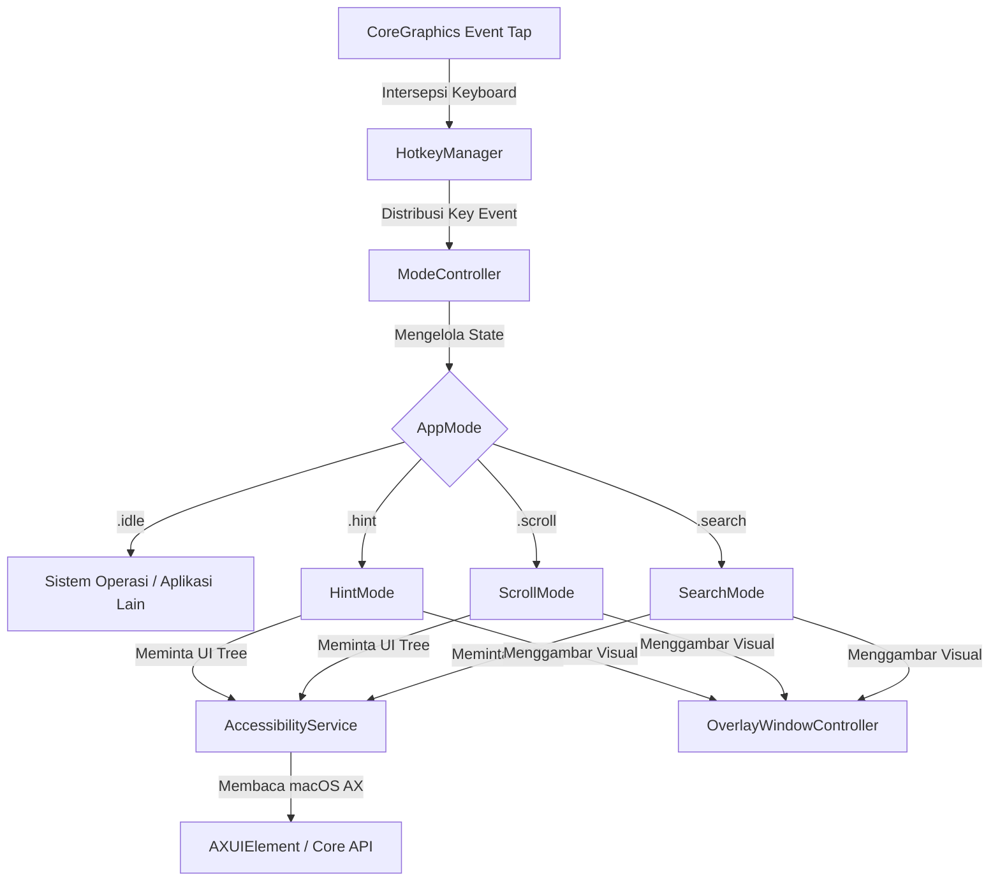
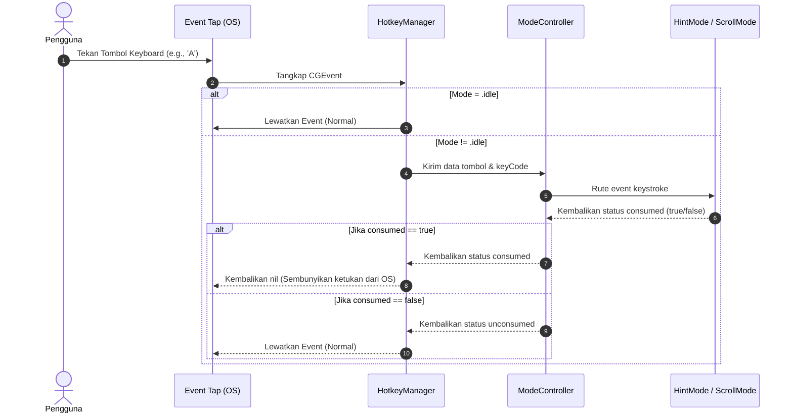

# 📘 Analisis Sistem & Dokumentasi Arsitektur: Hopr

Dokumen ini menyajikan analisis mendalam mengenai arsitektur perangkat lunak, pola desain, alur data, serta keputusan rekayasa yang diimplementasikan pada proyek **Hopr**. Analisis ini disusun dari sudut pandang **System Analyst** untuk memberikan pemahaman teknis komprehensif bagi pengembang yang ingin memelihara atau memperluas aplikasi.

---

## 1. Arsitektur Sistem Umum

Hopr dirancang sebagai aplikasi utilitas macOS berkinerja tinggi yang berjalan di latar belakang (tipe agen/`.accessory`). Aplikasi ini tidak memiliki jendela utama saat pertama kali dibuka, melainkan mengandalkan sistem *floating overlay* transparan yang muncul secara interaktif.

Sistem terdiri dari empat pilar utama:

### 1.1 Deskripsi Komponen Arsitektur
*   **Keyboard Interception Layer (`HotkeyManager`)**: Menggunakan API CoreGraphics tingkat rendah (`CGEvent.tapCreate`) untuk memantau keystroke global secara asinkron sebelum diterima oleh aplikasi target.
*   **State Machine (`ModeController`)**: Menentukan perilaku aplikasi berdasarkan status aktif saat ini (`idle`, `hint`, `scroll`, `search`).
*   **Accessibility Engine (`AccessibilityService`)**: Menjembatani aplikasi dengan sistem operasi macOS untuk mengambil pohon aksesibilitas (*Accessibility Tree*) dari jendela aplikasi aktif.
*   **Overlay Rendering Engine (`OverlayWindowController`)**: Menampilkan representasi visual (balon kata penunjuk, batas area gulir) tepat di atas elemen GUI yang sesungguhnya di layar komputer.

---

## 2. Analisis Rinci Komponen Kode

### 2.1 Core Services (Layanan Inti)

#### `AccessibilityService.swift`
Layanan ini bertugas melakukan penelusuran (*tree traversal*) secara rekursif terhadap elemen GUI sistem operasi.
*   **Mekanisme Caching**: Untuk mencegah perlambatan akibat komunikasi antar-proses (IPC) dengan Accessibility API macOS, kelas ini menerapkan *Time-To-Live (TTL)* cache sebesar `1.5 detik` (`cacheTTL = 1.5`). Jika permintaan pemindaian dilakukan berulang kali dalam jeda waktu tersebut, layanan langsung mengembalikan data memori tanpa melakukan IPC ulang.
*   **Metode Traversal**: Menggunakan rekursi mendalam hingga `depth < 10` untuk mencari elemen UI dengan peran fungsional seperti tombol (`AXButton`), kotak teks (`AXTextField`), tautan (`AXLink`), dll.
*   **Algoritma Deduplikasi Tumpang Tindih (`deduplicateOverlapping`)**:
    *   Sering kali dalam struktur hierarki macOS AX, elemen penampung (*parent*) memiliki area koordinat yang bertabrakan dengan elemen anak (*child*).
    *   Algoritma menghitung rasio interseksi area dari dua elemen: jika tumpang tindih melebihi `40%`, sistem akan memprioritaskan peran elemen yang lebih spesifik (misalnya, tombol lebih diprioritaskan daripada grup kontainer statis).
    *   **Pengecualian Jarak Titik Pusat**: Untuk menghindari pembuangan elemen kontrol yang tumpang tindih secara area tetapi secara fungsional berbeda (misalnya tombol menu kecil di dalam atau dekat dengan tautan kartu besar), ditambahkan pemeriksaan jarak Euclid antara kedua titik pusat. Jika jarak pusat melebihi `8.0` piksel, kedua elemen akan dipertahankan sebagai kontrol terpisah.

#### `UIElement.swift`
Sebuah model pembungkus (`struct wrapper`) untuk pointer internal `AXUIElement` macOS.
*   **Aksi Simulasi & Native**: Ketika label dipilih, `performAction()` akan mencoba memicu aksi aksesibilitas bawaan terlebih dahulu (seperti `AXPress`, `AXOpen`, `AXConfirm`, atau `AXPick`). Jika aplikasi target tidak menanggapi aksi tersebut, sistem secara otomatis beralih menggunakan simulasi tingkat rendah, yaitu mengirimkan event mouse down dan mouse up secara instan pada koordinat tengah elemen (`simulateClick()`).
*   **Simulasi Pergerakan Mouse (`moveCursorTo`)**: Untuk memastikan aplikasi target (khususnya browser seperti Chrome/Safari atau elemen web) mendaftarkan status hover, transisi kursor dilakukan secara bertahap. Sistem mula-mula memindahkan kursor ke posisi koordinat target (`centerPoint`), mengirimkan event `mouseMoved` dengan offset 1 piksel (`x - 1`), menjeda eksekusi selama `10ms` (`Thread.sleep(forTimeInterval: 0.01)`), lalu mengirimkan event `mouseMoved` kedua di koordinat target yang presisi. Hal ini memaksa aplikasi memicu selektor CSS `:hover` dan event Javascript `mouseover`/`mouseenter`.

#### `SoundManager.swift`
Layanan utilitas audio global yang mengelola efek suara taktil (*tactile feedback*) secara asinkron menggunakan API `NSSound` macOS.
*   **Umpan Balik Suara Instan**: Memainkan suara transisi saat berpindah mode (`playEnterMode()` memainkan `click7.m4a`) dan saat terjadi aktivasi/klik elemen (`playActivate()` memainkan `click1.m4a`). Tombol pengetikan reguler sengaja dibuat hening agar alur kerja tetap fokus dan tenang.
*   **Mekanisme Resolusi Path Pintar**: Memeriksa folder `Resources/` di direktori kerja saat ini (*current directory*) terlebih dahulu untuk mengakomodasi lingkungan pengembangan lokal sebelum beralih ke jalur absolut cadangan (*fallback path*) di `/Users/macbook/Documents/Project/hopr/Resources/`.

---

### 2.2 Input Handling & Event Distribution

#### `HotkeyManager.swift`
Bertugas mendaftarkan event tap keyboard di bawah mode `.cgSessionEventTap`.
*   **Pemantauan Modifier Keys (`.flagsChanged`)**: Pintu masuk tap keyboard juga mendengarkan tipe event `.flagsChanged` untuk mendeteksi penekanan tombol modifier seperti `Shift` (Left Shift `keyCode 56` atau Right Shift `keyCode 60`). Informasi status ini diteruskan ke mode aktif melalui `ModeController.handleShiftKeyChanged(isPressed:)`.
*   **Pencegatan Input (Event Suppression)**: Ketika aplikasi berada dalam salah satu mode aktif (`hint`, `scroll`, `search`), `handleEvent` akan mengembalikan nilai `nil` untuk setiap tombol yang digunakan dalam interaksi internal. Ini secara efektif menekan tombol tersebut agar tidak masuk ke sistem operasi atau aplikasi aktif di belakang layar, sehingga mencegah karakter terketik secara tidak sengaja di dokumen pengguna.
*   **Fungsi Pemetaan Tombol & Pintasan Global Interaktif**: Mengonversi kode kunci virtual (`keyCode` perangkat keras) menjadi karakter string yang relevan dengan mempertimbangkan status penekanan tombol `Shift`.
*   **Pintasan Global yang Fleksibel**: Pengguna dapat menekan pintasan global (seperti `Cmd+Shift+Space` untuk Hint Mode, `Cmd+Shift+J` untuk Scroll Mode, dll.) kapan saja. Jika ditekan saat mode tersebut aktif, mode akan langsung dinonaktifkan (toggle off). Jika ditekan saat berada di mode lain, aplikasi akan langsung menonaktifkan mode saat ini dan mengaktifkan mode baru yang diminta tanpa harus kembali ke status `idle` terlebih dahulu.

---

### 2.3 Visual & Rendering Engine

#### `OverlayWindowController.swift`
Merupakan komponen krusial yang mengontrol antarmuka grafis di layar.
*   **Optimasi Jendela Tunggal (Single-Window Optimization)**:
    > [!IMPORTANT]
    > Alih-alih membuat satu jendela (`NSWindow`) terpisah untuk setiap label petunjuk (yang akan membebani komposit grafis macOS jika ada lebih dari 100 elemen), sistem membuat **satu jendela transparan raksasa** yang membentang di seluruh layar (`screenFrame`). Semua objek label (`LabelView`) kemudian ditambahkan sebagai subview biasa di dalam satu jendela tersebut. Teknik ini menghemat memori GPU secara drastis dan memastikan rendering instan (< 16ms).
*   **Konversi Koordinat**:
    Sistem aksesibilitas macOS menggunakan titik asal (`origin`) di sudut kiri atas layar ($y$ bernilai positif ke bawah). Sementara kerangka kerja grafis AppKit/Cocoa menggunakan titik asal di sudut kiri bawah layar ($y$ bernilai positif ke atas). `OverlayWindowController` melakukan kalkulasi pembalikan sumbu-$y$ berdasarkan tinggi monitor aktif (`screenHeight - y - height`) serta mendukung deteksi layar multi-monitor (`bestScreen`).
*   **Animasi Transisi Visibilitas (`setOverlayVisible`)**: Menyediakan fungsi transisi visibilitas yang halus menggunakan `NSAnimationContext.runAnimationGroup`. Saat diaktifkan, jendela memudar masuk (fade-in) ke `alphaValue = 1.0` selama `0.12` detik dengan kurva `.easeOut`. Saat disembunyikan, jendela memudar keluar (fade-out) ke `alphaValue = 0.0` selama `0.10` detik dengan kurva `.easeIn` sebelum jendela dinonaktifkan (`orderOut`).

#### `LabelView.swift` & `HighlightBoxView.swift` & `ScrollAreaBoxView.swift`
Komponen visual kustom yang dirancang untuk estetika modern, responsif, dan performa tinggi:
*   **`LabelView.swift`**: Menampilkan balon kata berisi kode label dengan warna kuning cerah premium. Sudut visual dibuat lebih tajam (`xRadius: 2.5`), dan letak pointer vertikal disesuaikan secara cerdas (`above` vs `below` elemen) untuk mencegah pemotongan di batas layar. Menerapkan animasi transformasi skala (`scale = 1.4x`) dan pemudaran opacity asinkron melalui CoreAnimation saat elemen berhasil dieksekusi.
*   **`HighlightBoxView`**: Menggambar kotak sorot semi-transparan dengan ketebalan border 3.0pt beraksen warna kontrol sistem (`controlAccentColor`), lengkap dengan efek cahaya (*drop shadow blur = 8.0*) untuk memperjelas elemen terfokus pada Search Mode. Pergeseran posisi antar elemen menggunakan animasi koordinat halus dari `NSAnimationContext`.
*   **`ScrollAreaBoxView.swift`**: Menggambar bingkai area scroll aktif dengan skema warna hijau taktil (`systemGreen`) atau aksen sistem, serta badge pill nomor urutan di pojok kiri atas. Menerapkan efek animasi memantul (*bounce scale 1.06x*) instan saat area gulir dipilih oleh pengguna.
*   **`ModeIndicator.swift`**: HUD melayang yang menampilkan status mode aktif saat ini. Menggunakan `NSVisualEffectView` dengan material `.hudWindow` untuk rendering efek kaca transparan yang menyatu dengan estetika macOS Ventura+.

---

### 2.4 Mode Operasional & Logika State

Aplikasi dibagi menjadi 3 mode operasional independen yang dikoordinasikan oleh `ModeController`:

| Nama Mode | Trigger Keyboard | Deskripsi Logika Internal |
| :--- | :--- | :--- |
| **Hint Mode** | `Cmd+Shift+Space` | 1. Memindai seluruh elemen UI aktif. 2. Menghasilkan label huruf unik (A, B, C... AA, AB...) menggunakan algoritma `KeyMapper`. 3. Menerima input huruf pengguna secara beruntun. 4. Menyaring label yang cocok dengan awalan pengetikan. 5. Memicu aksi klik jika terjadi kecocokan tepat (*exact match*) atau sisa 1 kandidat. 6. Keluar ke mode `idle`.  7. **Sembunyikan Petunjuk Sementara**: Mengetuk tombol `Shift` dua kali berturut-turut (double-tap dalam 500ms) akan menyembunyikan overlay petunjuk secara sementara tanpa membatalkan mode. Selama disembunyikan, event tombol diteruskan langsung ke sistem operasi (tidak dicegat) untuk mempermudah pemantauan layar di belakang overlay. Ketuk dua kali tombol `Shift` lagi untuk menampilkan kembali overlay petunjuk. |
| **Scroll Mode** | `Cmd+Shift+J` | 1. Mendeteksi elemen kontainer dengan peran `AXScrollArea` atau `AXWebArea`. 2. Menampilkan angka indeks (`1-9`) di atas area tersebut. 3. Pengguna menekan angka untuk memilih area aktif. 4. Setelah terpilih, sistem mengarahkan kursor virtual ke tengah area tersebut. 5. Memasuki loop fisika akselerasi kontinu menggunakan input tombol Vim (`J`, `K`, `H`, `L`) untuk mengirimkan event scroll pixel kustom. |
| **Search Mode** | `Cmd+Shift+/` | 1. Membuka panel pencarian mengambang berbasis `NSVisualEffectView` di tengah layar. 2. Pengguna mengetik kata kunci pencarian (berdasarkan judul atau jenis peran elemen). 3. Menampilkan daftar dropdown dinamis kustom (maksimal 6 baris teratas) dengan indikator label huruf. 4. Navigasi baris aktif menggunakan tombol `Up` / `Down` yang disinkronkan dengan kotak sorot visual (`HighlightBoxView`) di layar. 5. Menekan `Enter` akan memicu klik asinkron dan menutup panel. |

#### 2.4.1 Mesin Simulasi Fisika Scroll (Scroll Physics Engine)
Aplikasi tidak menerapkan pergeseran scroll yang kaku (statis), melainkan menggunakan model matematika fisika kontinu untuk meniru kehalusan gerak *inertial scrolling* macOS asli:
*   **Loop Pembaruan (Physics Loop)**: Menggunakan `Timer` internal yang berdetak setiap `0.016 detik` (menghasilkan ~60 frame per detik) untuk menghitung perubahan kecepatan (*velocity*) asinkron.
*   **Akselerasi & Hambatan**:
    *   Saat tombol arah Vim ditekan, gaya akselerasi sebesar `accelRate = 0.20` per frame diterapkan pada sumbu kecepatan hingga menyentuh batas maksimum `baseSpeed * 2.5`.
    *   Pengubah kecepatan dinamis diambil dari model `AppSettings` (`scrollSpeed` dasar atau `dashSpeed` turbo saat tombol `Shift` ditekan).
    *   Ketika tombol dilepas, gaya gesekan (*friction = 0.85*) diterapkan secara eksponensial di setiap detak frame hingga kecepatan menurun di bawah ambang batas minimal `0.1` piksel/frame, di mana gerakan dihentikan total.
*   **Simulasi Event**: Event gulir dikirim langsung ke sistem menggunakan `CGEvent(scrollWheelEvent2Source:nil, units:.pixel, ...)` untuk mengontrol piksel per piksel secara mulus.

#### 2.4.2 Dropdown Hasil Pencarian & Animasi Resizing
HUD pencarian dioptimalkan agar terasa intuitif dan premium:
*   **Struktur Visual Dropdown**: Menggunakan `SearchResultRowView` dengan tata letak horizontal yang memisahkan badge huruf label di sebelah kiri, judul elemen di tengah, dan tipe peran aksesibilitas (`AXRole` yang dibersihkan dari prefiks "AX") di sebelah kanan.
*   **Dukungan Scroll Jendela Pandang (View Porting)**: Dropdown membatasi rendering visual maksimal 6 baris demi performa dan ukuran. Jika hasil pencarian melebihi 6 item, sistem menggunakan indeks virtual `firstVisibleIndex` untuk menggeser baris yang ditampilkan sesuai pergerakan navigasi keyboard pengguna.
*   **Animasi Resizing Dinamis**: Ketinggian jendela pencarian (`NSPanel`) diubah secara dinamis tergantung pada jumlah hasil yang cocok. Transisi tinggi jendela menggunakan blok `NSAnimationContext.runAnimationGroup` dengan durasi `0.15 detik` dan kurva kecepatan `.easeOut` untuk kenyamanan visual.

---

## 3. Pola Desain (Design Patterns)

Proyek ini menerapkan beberapa pola desain perangkat lunak yang mapan:

1.  **Singleton Pattern**: Diterapkan pada `AccessibilityService` dan `AppSettings` karena hanya diperlukan satu instansi global yang mengelola status koneksi aksesibilitas dan preferensi pengguna selama daur hidup aplikasi.
2.  **Observer Pattern**: Menggunakan `NotificationCenter` bawaan macOS untuk memancarkan event penyelesaian tugas dari satu kelas ke kelas lain (misalnya, `HintMode` memberi tahu `AppDelegate` untuk kembali ke status `idle` setelah simulasi klik selesai).
3.  **State Pattern**: Diwakili oleh kombinasi `ModeController` dan enum `AppMode` yang memisahkan perilaku penanganan input keyboard berdasarkan mode operasional yang sedang berjalan.

---

## 4. Evaluasi & Analisis Potensi Masalah (Technical Debt)

Sebagai **System Analyst**, berikut adalah beberapa keterbatasan teknis saat ini serta rencana mitigasi yang dapat diimplementasikan di masa mendatang:

### 4.1 Batasan Keamanan macOS Sandbox
Karena aplikasi menggunakan API `CGEvent.tapCreate` dan memerlukan status tepercaya proses (`AXIsProcessTrusted`), aplikasi ini **tidak dapat dipublikasikan ke Mac App Store** dengan pembatasan Sandbox standar. Aplikasi harus didistribusikan secara independen dengan panduan manual bagi pengguna untuk mengaktifkan izin Aksesibilitas di menu *System Settings > Privacy & Security > Accessibility*.

### 4.2 Ketergantungan Kompatibilitas Aplikasi Target
*   **Masalah**: Beberapa aplikasi pihak ketiga (seperti aplikasi berbasis Electron atau Java Swing yang tidak mengimplementasikan protokol Aksesibilitas macOS dengan benar) tidak akan melaporkan koordinat elemen UI mereka ke `AccessibilityService`.
*   **Solusi debug**: File pembantu [debug_ax.swift](file:///Users/macbook/Documents/Project/hopr/debug_ax.swift) disediakan untuk memverifikasi apakah struktur pohon aplikasi target dapat dibaca oleh macOS atau tidak.

### 4.3 Peningkatan Skalabilitas yang Direkomendasikan
*   **Hover Event Simulation**: Saat ini, aplikasi hanya mendukung simulasi klik kiri. Menambahkan dukungan simulasi melayang (*hover*) dengan menahan tombol pengubah tertentu sebelum mengklik dapat sangat meningkatkan kenyamanan navigasi.
*   **Custom Shortcuts**: Pintasan global (`Cmd+Shift+Space`, dll.) saat ini masih ditulis keras (*hardcoded*) dalam kode sumber `HotkeyManager.swift`. Sangat disarankan untuk memindahkan definisi pintasan ini ke dalam model `AppSettings` agar dapat diubah secara dinamis oleh pengguna melalui SwiftUI Settings View.
