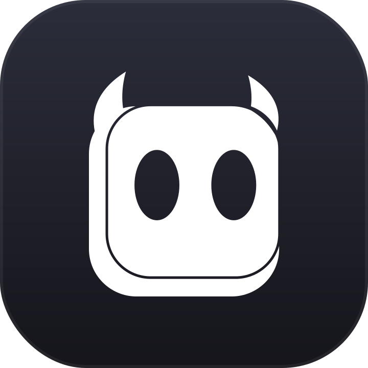

<p align="center">
  
</p>

<h1 align="center">Hopr</h1>

<p align="center">
  Control your entire macOS UI from the keyboard — no mouse required.
</p>

---

**Hopr** is a macOS utility that lets you drive the entire graphical user interface from the keyboard — no mouse required. It uses the **Accessibility API (ApplicationServices)** and **CoreGraphics Event Taps** to inspect on-screen UI elements and synthesize input in real time.

Hopr runs as a background agent with no Dock icon (an `.accessory`/`LSUIElement` app), lives in the menu bar, and is always a global hotkey away.

---

## 🚀 Features

Hopr offers three keyboard-driven modes built for speed:

1. **Hint Mode (`Cmd+Shift+Space`)**
   - Overlays text labels (*hints*) on every clickable UI element on screen (buttons, links, text fields, etc.).
   - Typing a label's letters instantly performs a left click or focuses that element.
   - A 400 ms *smart delay* kicks in when labels share a prefix (e.g. `A` vs `AB`), giving you time to type the next letter before the action fires.

2. **Scroll Mode (`Cmd+Shift+J`)**
   - Detects every scrollable region in the active window (text editors, web pages, terminals, etc.).
   - Pick a target region with `1`–`9`, then scroll with Vim-style keys:
     - `J` — scroll down
     - `K` — scroll up
     - `H` — scroll left
     - `L` — scroll right
   - Hold `Shift` for turbo (*Dash*) scroll speed.

3. **Search Mode (`Cmd+Shift+/`)**
   - Opens a translucent HUD search panel (`NSVisualEffectView`) centered on screen with smooth show/hide animation.
   - Searches UI elements in real time by title or accessibility role.
   - Shows a results dropdown (top 6 matches) with letter-badge labels.
   - Move the selection with the `Up` / `Down` arrow keys.
   - A premium highlight box (`HighlightBoxView`) tracks the currently selected element on screen.
   - Press `Enter` to confirm, dismiss the panel, and click the highlighted element.

**Plus:**

- **HUD mode indicator & menu bar** — a floating glass (*vibrancy*) pill shows the active mode; the menu bar gives quick access to modes, preferences, and quit.
- **Audio feedback** — tactile sound cues on mode switch (`click7.m4a`) and on click/activation (`click1.m4a`), played via `NSSound`.

---

## 🛠️ Requirements

- **macOS 13.0 (Ventura) or newer.**
- **Xcode Command Line Tools** (provides the Swift toolchain). Install with:
  ```bash
  xcode-select --install
  ```
- **Accessibility permission.** Hopr needs Accessibility access to read the UI hierarchy and synthesize clicks. It will prompt you on first launch — see [Granting permissions](#-granting-permissions) below.

---

## ⚙️ Build & Run

Hopr is built with **Swift Package Manager (SPM)**.

```bash
git clone https://github.com/zerodevid/hopr.git
cd hopr
```

### Run from source (development)

```bash
swift run
```

### Build an optimized release binary

```bash
swift build -c release
```

The compiled binary lands at `.build/release/Hopr`.

### Build a distributable `.app` bundle (recommended)

The bare SPM executable works for development, but the **Launch at Login** feature
(`SMAppService`) only works from a real, signed `.app` bundle. Use the bundled
script to produce one:

```bash
./package.sh            # release, universal (arm64 + x86_64), ad-hoc signed → ./dist
./package.sh --debug    # use the debug build instead of release
./package.sh --native   # build only for this Mac's architecture (faster local dev)
```

The bundle is written to `dist/Hopr.app`. To run or install it:

```bash
open dist/Hopr.app
# or install to Applications:
cp -R dist/Hopr.app /Applications/ && open /Applications/Hopr.app
```

> **Distributing to other Macs?** Ad-hoc signing only works on the machine that
> built it. Re-run with a Developer ID identity:
> ```bash
> CODESIGN_ID="Developer ID Application: Your Name (TEAMID)" ./package.sh
> ```

### Run tests

```bash
swift test
```

---

## 🔐 Granting permissions

On first launch, Hopr requests **Accessibility** access. If you miss the prompt,
grant it manually:

1. Open **System Settings → Privacy & Security → Accessibility**.
2. Enable **Hopr** (or your terminal app, if you're running via `swift run`).
3. Restart Hopr.

Without this permission, Hopr cannot read UI elements or send clicks.

---

## 🪵 Debugging the UI hierarchy (AX Tree)

Helper scripts are included to dump the *Accessibility Tree* of a running app
(e.g. VSCode), which is useful for understanding which elements Hopr can detect:

```bash
swift debug_ax.swift
```

---

## 📁 Source layout

```
.
├── Resources/                        # Sound assets (click1.m4a, click7.m4a, …)
├── package.sh                        # Builds a signed Hopr.app bundle
└── Sources/Hopr/
    ├── App/
    │   ├── main.swift                 # Entry point & .accessory app configuration
    │   └── AppDelegate.swift          # Lifecycle, status bar menu, mode coordination
    ├── Core/
    │   ├── AccessibilityService.swift # AX tree scanning, filtering & caching
    │   ├── UIElement.swift            # AXUIElement wrapper & click handling
    │   ├── ScrollableArea.swift       # Scrollable-region representation
    │   └── Permissions.swift          # macOS Accessibility permission checks
    ├── Input/
    │   ├── HotkeyManager.swift        # Global keyboard interception via Event Taps
    │   └── KeyMapper.swift            # Dynamic letter-label generator (A-Z, AA-ZZ)
    ├── Modes/
    │   ├── ModeController.swift       # State machine (.idle, .hint, .scroll, .search)
    │   ├── HintMode.swift             # Label-input matching & click execution
    │   ├── ScrollMode.swift           # Scroll navigation & repeat timer
    │   └── SearchMode.swift           # Text-based element search & search HUD
    ├── Models/
    │   └── AppSettings.swift          # @AppStorage-backed user preferences
    ├── Overlay/
    │   ├── OverlayWindowController.swift # Renders overlay windows above all apps
    │   ├── LabelView.swift            # Draws the element hint label balloons
    │   ├── ScrollAreaBoxView.swift    # Borders & number badges for scroll areas
    │   └── ModeIndicator.swift        # Glass HUD pill for the active mode
    └── Utils/
        ├── Logger.swift               # Logging utility
        ├── Notifications.swift        # Cross-mode notification hub
        └── SoundManager.swift         # Async sound-effect feedback manager
```

---

## 📄 Further reading

For an in-depth look at the workflow, performance optimizations, and technical
implementation, see [ARCHITECTURAL_DOCUMENTATION.md](ARCHITECTURAL_DOCUMENTATION.md).

---

## 📜 License

Copyright © 2026. Built for keyboard-driven macOS control.
</content>
</invoke>
